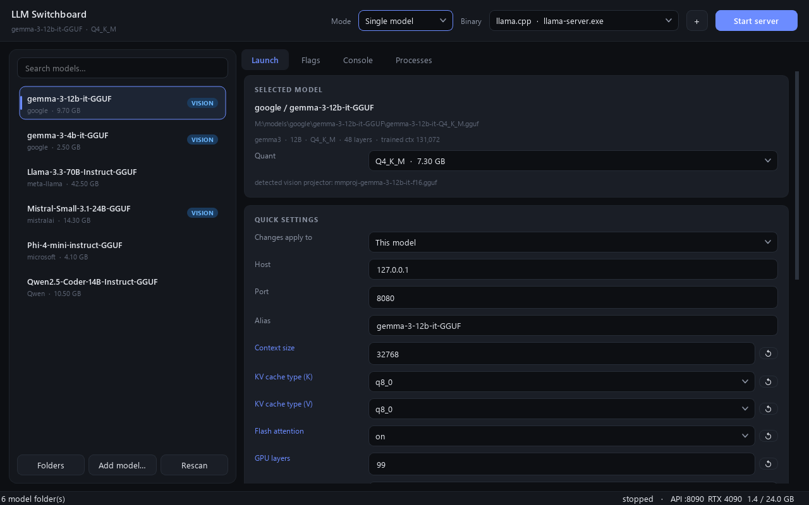
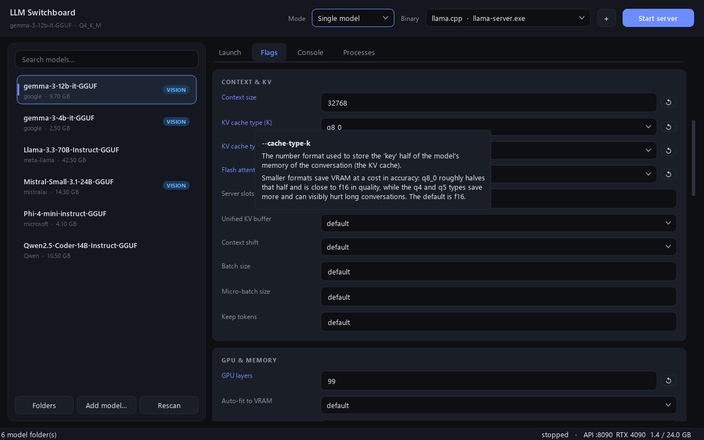
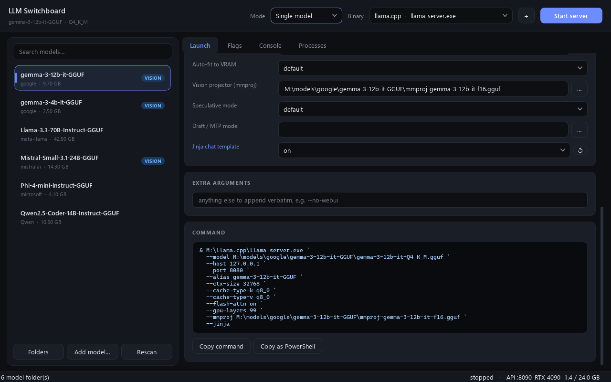
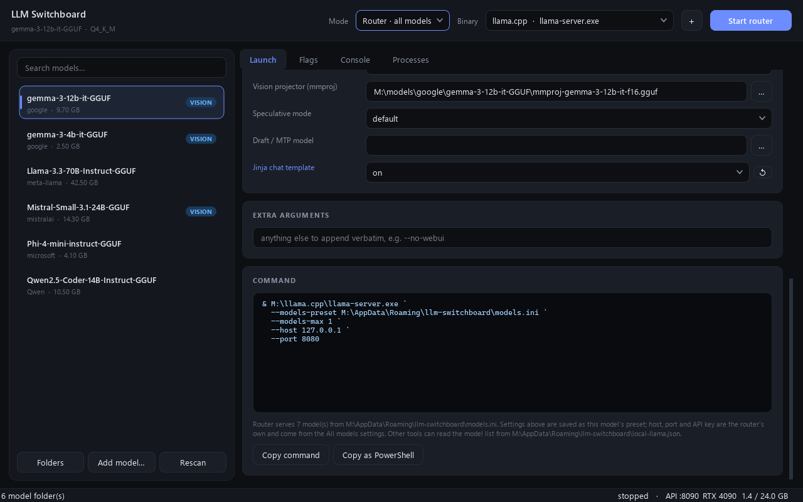
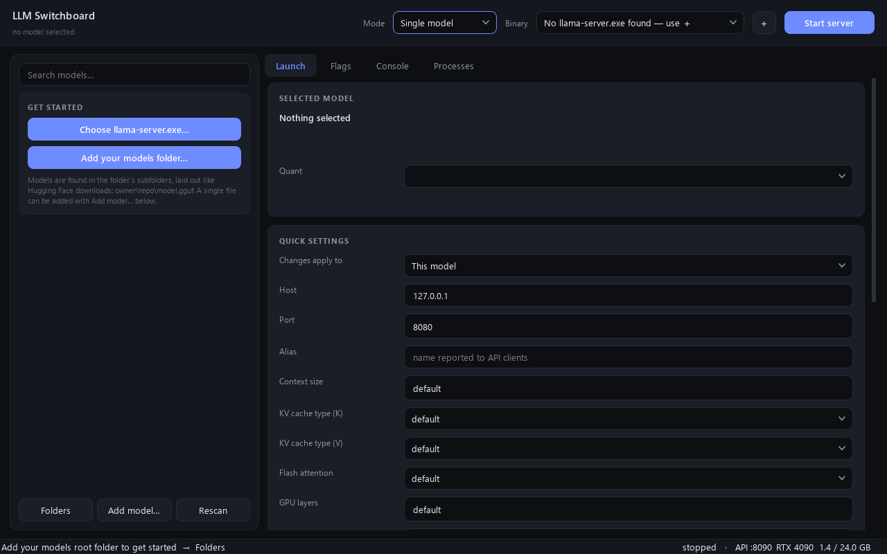

# LLM Switchboard

A Windows desktop app for running local LLM servers on one GPU. It finds the models on your
drive, builds each server's command line from settings you pick in a form, and starts and
stops the servers for you.



It drives three engines:

| Engine | What the app does |
|---|---|
| [llama.cpp](https://github.com/ggml-org/llama.cpp) (`llama-server.exe`) | Serves one GGUF model, or runs the router so every model in the library is available on one port and loads on request. |
| NInfer (`ninfer-serve.exe`) | Serves one `.ninfer` artifact, with settings saved per artifact. |
| Strata | Launches Strata's own server with one of the configs its setup wrote. |

You only need the engines you use. llama.cpp alone is enough.

## What it gives you

- **Model library.** Point it at a folder laid out like Hugging Face downloads
  (`<root>\<owner>\<repo>\*.gguf`). Vision projectors, MTP heads and draft models that sit
  beside a model are detected and wired up.
- **Every flag explained.** Each llama-server flag has a control with a hover tooltip that
  says what it does, what it costs, and what happens if you leave it alone.
- **Global defaults with per-model overrides.** Change a default once and every model follows,
  except where a model deliberately differs.
- **Router mode.** Writes the `models.ini` preset file for llama.cpp's router and reloads a
  running router when settings change.
- **Live command preview**, with warnings for a port in use, flags the selected build does not
  have, a context above the model's trained size, or a model larger than free VRAM.
- **Control API** on `127.0.0.1:8090`, so scripts and agents can suspend an engine to free the
  GPU and resume it afterwards. See [CONTROL_API.md](CONTROL_API.md).

## Screenshots

**Every flag has a tooltip** saying what it does, what it costs and what the default is.



**The command is built as you change settings**, and can be copied as it is.



**Router mode** serves the whole library on one port from a generated preset file.



The screenshots use placeholder model files and a made-up GPU readout.

## Requirements

- Windows 10 or 11. The app uses `taskkill`, PowerShell and `.exe` engine names.
- An NVIDIA GPU with `nvidia-smi` on the PATH for the VRAM readout. Without it the app still
  works but shows no GPU figures.
- Python 3.10 or newer to run from source.
- At least one engine, downloaded separately.

## Run from source

```powershell
python -m venv .venv
.venv\Scripts\pip install -r requirements.txt
.venv\Scripts\python main.py
```

## Build the exe

```powershell
.venv\Scripts\pip install -r requirements-build.txt
.venv\Scripts\activate
.\build.ps1
```

The result is `dist\llm-switchboard\llm-switchboard.exe`. Keep the folder together.

## First run

The panel on the left walks you through the two things the app needs:



1. **Choose llama-server.exe…** and pick the file from your llama.cpp download.
2. **Add your models folder…** and pick the folder that holds your models.
3. Select a model, adjust the quick settings, and press **Start server**.

Both can be changed later with **＋** beside *Binary* and with **Folders**.

For NInfer or Strata, switch *Mode* and choose the install folder on that page. Their
Start buttons appear once a folder is set.

## Where settings are kept

`%APPDATA%\llm-switchboard\` holds `settings.json`, the generated `models.ini`, and
`local-llama.json`, a small manifest of what is being served that other local tools can read.
An API key, if you set one, is stored there in plain text.

## License

MIT. See [LICENSE](LICENSE).
